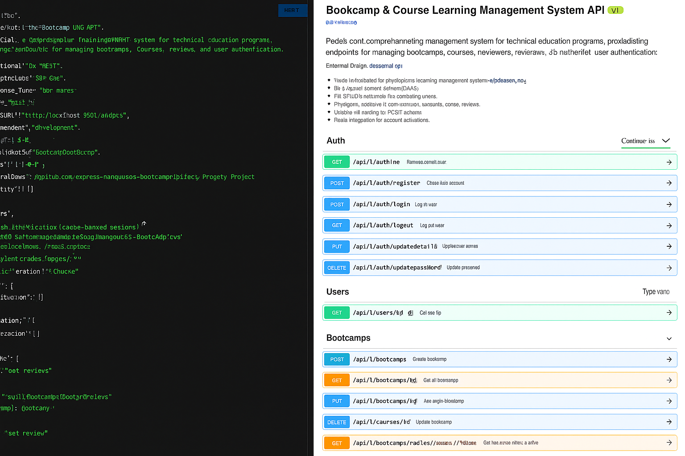

# DevCamper API

> Backend API for DevCamper application, which is a bootcamp directory website

## Usage

Open the "index.html" file in the public folder via live server- by doing so you can have a preview of all the routes used in this application and use as such. eg: api/v1/bootcamps, api/v1/users

## Install Dependencies

```
npm install
```

## Run App

```
# Run in dev mode

npm run dev

# Run in prod mode

npm start
```

### Database Seeder

To seed the database with users, bootcamps, courses and reviews with data from the "\_data" folder, run

### Destroy all data

node seeder -d

### Import all data

node seeder -i

- Version: 1.0.0
- License: MIT

Here is an expected gif of the preview of routes of the index.html


# Bootcamp Learning Management System (LMS) API

[](https://opensource.org/licenses/MIT)
[](https://nodejs.org/)
[](https://expressjs.com/)

A robust backend API for managing technical education programs, featuring secure authentication, role-based access control, and advanced data management capabilities.

## 📌 Features

### 🔒 Authentication & Security

- JWT Authentication with HTTP-only cookies
- Two-Factor Authentication (2FA) via email
- Role-Based Access Control (User, Publisher, Admin)
- Rate limiting (100 requests/15 minutes)
- Helmet security headers
- XSS protection & MongoDB sanitization

### 🏫 Bootcamp Management

- Geospatial search by location/radius
- File upload for bootcamp photos
- CRUD operations with advanced filtering
- Average cost calculations
- Multi-tenancy support

### 📚 Course System

- Curriculum management
- Scholarship availability tracking
- Automated tuition averaging
- Skill level requirements
- Relationship mapping with bootcamps

### ⭐ Review System

- Rating system (1-10 scale)
- Automated average rating calculations
- Unique user reviews per bootcamp
- Rich text reviews with titles
- Population of related data

### 📊 Advanced Features

- Pagination & sorting
- Query filtering (gt, gte, lt, lte, in)
- Database seeding utility
- Email integration (SMTP)
- Error handling middleware
- API documentation (Swagger/OpenAPI)

## 🛠 Technologies Used

- **Runtime**: Node.js 18.x
- **Framework**: Express 4.x
- **Database**: MongoDB 6.x
- **ODM**: Mongoose 7.x
- **Security**:
  - bcryptjs
  - JWT
  - Helmet
  - xss-clean
- **Utilities**:
  - Nodemailer
  - Slugify
  - Node Geocoder
  - Express Fileupload

## 🚀 Installation

1. Clone repository:

```bash
git clone https://github.com/ressuman/DevCamper-Bootcamp-Backend-Directory-Project.git
cd DevCamper-Bootcamp-Backend-Directory-Project
```

2. Install dependencies:

```bash
npm install
```

3. Configure environment:

```bash
cp config/config.env.example config/config.env
```

4. Start server:

```bash
# Development
npm run dev

# Production
npm start
```

## ⚙ Configuration

Update `config/config.env` with your credentials:

```ini
NODE_ENV=development
PORT=5193
MONGO_URI=mongodb+srv://<user>:<password>@cluster.mongodb.net/dbname
JWT_SECRET=your_jwt_secret
JWT_EXPIRE=30d
SMTP_HOST=smtp.mailtrap.io
SMTP_PORT=2525
SMTP_USER=mailtrap_user
SMTP_PASSWORD=mailtrap_password
FILE_UPLOAD_PATH=./public/uploads
MAX_FILE_UPLOAD=1000000 # 1MB
```

## 📚 API Documentation

Interactive documentation available via Swagger UI:
`http://localhost:5193/api-docs`

### Example Request

```bash
# Get bootcamps within 10 miles of 02108
curl -X GET "http://localhost:5193/api/v1/bootcamps/radius/02108/10"
```

### Schemas

| Resource | Fields                                                                 |
| -------- | ---------------------------------------------------------------------- |
| Bootcamp | name, description, careers, location, photo, housing, etc.             |
| Course   | title, description, weeks, tuition, minimumSkill, scholarshipAvailable |
| User     | name, email, role, password, resetPasswordToken, twoFactorCode         |
| Review   | title, text, rating, bootcamp, user                                    |

## 🔐 Security Implementation

1. **Authentication**:

   - JWT stored in HTTP-only cookies
   - 2FA via email codes
   - Password reset tokens with expiration

2. **Authorization**:

   - Role hierarchy (User < Publisher < Admin)
   - Resource ownership validation
   - Protected routes middleware

3. **Validation**:

   - Request body sanitization
   - MongoDB operator injection prevention
   - File type/size restrictions

4. **Monitoring**:
   - Rate limiting
   - Request logging
   - Error tracking

## 📦 Database Models


**Key Relationships**:

- Bootcamp ↔ Courses (1:M)
- Bootcamp ↔ Reviews (1:M)
- User ↔ Bootcamps (1:M)
- User ↔ Courses (1:M)
- User ↔ Reviews (1:M)

## 📜 License

This project is licensed under the MIT License - see the [LICENSE](LICENSE) file for details.

## 🙏 Acknowledgments

- Inspired by DevCamper project
- Bootcamp industry best practices
- Open source community contributions

This README provides:

1. Clear installation/configuration instructions
2. Comprehensive feature overview
3. API documentation details
4. Security implementation insights
5. Technology stack visibility
6. Database structure information
7. Licensing and acknowledgments

You can enhance it further by:

1. Adding actual ER diagrams
2. Including screenshots of API documentation
3. Adding CI/CD badges
4. Expanding the testing section
5. Adding deployment instructions
6. Including contribution guidelines
7. Adding a changelog section

## Image

Here is an expected gif/photos of the preview of the App(DevCamper Bootcamp LMS API)

## 
